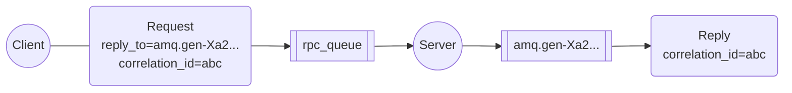

```mermaid
flowchart LR
    C((Client))
    R(Request\nreply_to=amq.gen-Xa2...\ncorrelation_id=abc)
    Q1[[rpc_queue]]
    S((Server))
    Q2[[amq.gen-Xa2...]]
    R2(Reply\ncorrelation_id=abc)
    C --- R
    R --> Q1
    Q1 --> S
    S --> Q2
    Q2 --> R2
    R2
  
```